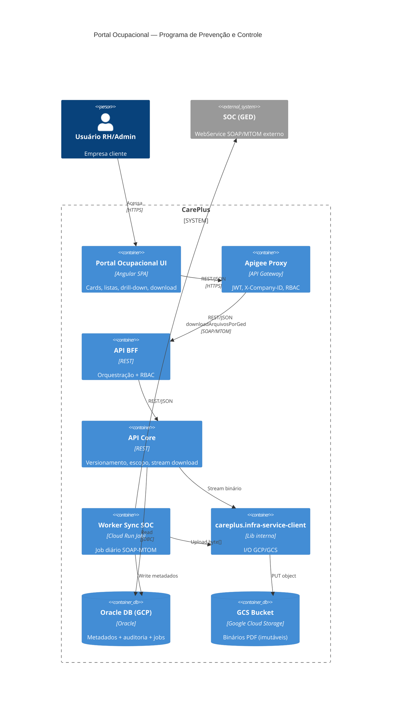
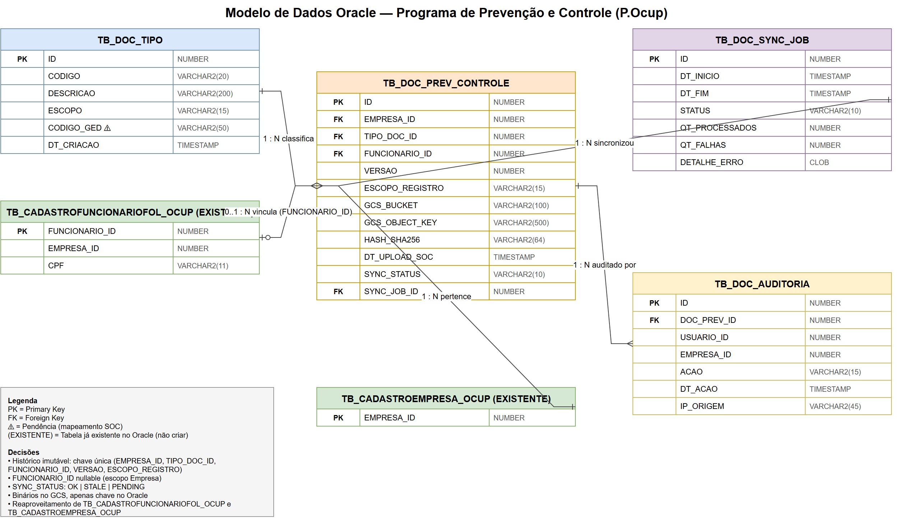
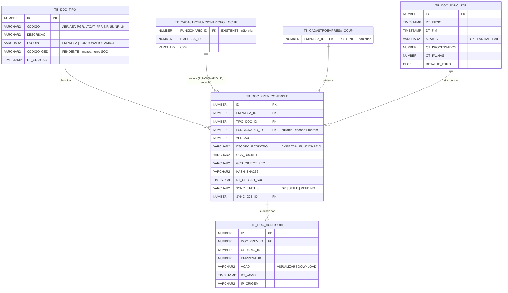

# ADR - [US-248562] - [Consulta de Documentação Técnica — Programa de Prevenção e Controle (P.Ocup)] - Solução de Arquitetura

## Arquivo de Decisão de Arquitetura (ADR)

### Título: Consulta de Documentação Técnica — Programa de Prevenção e Controle no Portal Ocupacional

**Data**: 2026-05-05
**Autores**: Felipe Moraes Anéas (Arquiteto Sênior), Time Portal Ocupacional, Time Integração SOC, PO Saúde Ocupacional

## Features

Avaliação de implementação de integração entre o **Portal Ocupacional (CarePlus)** e o sistema externo **SOC (GED)** para disponibilizar consulta, versionamento e download de documentos técnicos de Saúde e Segurança do Trabalho (SST), com sincronização diária via Worker e segregação de acesso por perfil RH/Admin.

[Solution Design - SD-248562 - Programa de Prevenção e Controle | P.Ocup](./SD-248562.md)

## Classificação de Domínio e Subdomínio

| Classificação  | Domínio e Subdomínio                            |
| -------------- | ----------------------------------------------- |
| Empresa        | Care Plus                                       |
| Domínio        | Saúde Ocupacional (SST)                         |
| Subdomínio     | Documentação Técnica — Prevenção e Controle    |
| Departamento   | Portal Ocupacional / Recursos Humanos (cliente) |

## Contexto

O Portal Ocupacional precisa permitir que usuários **RH/Administrador** das empresas clientes consultem e baixem documentos técnicos de SST (PGR, LTCAT, AET, AEP, PPP, laudos NR-15/16, treinamentos NR-05/06/17 — totalizando **17 tipos** distribuídos em três escopos: **Empresa**, **Funcionário** e **Ambos**).

O **SOC** é a fonte única de verdade desses documentos (GED), porém:

- **Não pode ser consultado em runtime** pelo Portal (latência alta, indisponibilidade frequente, custo de licença por chamada).
- Disponibiliza um **WebService SOAP** (`downloadArquivosPorGed`) com resposta MTOM/XOP em Base64, adequado para consumo em batch.
- Exige tolerância a falhas — atrasos ou indisponibilidades não podem derrubar o Portal nem expor dados desatualizados sem aviso.

### Opções Consideradas

1)  Sincronização diária via Worker (escolhida):** Worker em background lê o SOC uma vez por dia, persiste metadados no Oracle e binários no GCS via `careplus.infra-service-client`. Portal consulta apenas o cache local.
2) Download de arquivo existente no GCS:**  download direto pelo browser.

## Decisão

Adotaremos a **sincronização diária via Worker**, com download em **stream servido pelo Core** via `careplus.infra-service-client` (sem URL assinada). Esta decisão garante disponibilidade independente do SOC.

### Tela consumidora — Portal Ocupacional UI

O consumo do download será realizado pela tela **"Programas de Prevenção e Controle"** do **Portal Ocupacional** (Angular SPA), acessível apenas a perfis **RH/Administrador** (a funcionalidade é **ocultada do menu** para demais perfis). A tela orquestra todo o fluxo de visualização e download:

1. **Tela inicial — dois cards:** ao acessar a funcionalidade, o usuário vê dois cards de entrada — `Documentos da Empresa` e `Documentos do Funcionário` — populados via `GET /api/v1/prevention-control/categories` (BFF).

2. **Card "Documentos da Empresa":** lista direta dos documentos coletivos (PGR, LTCAT corporativo, AEP, AET, Dosimetria, Atas CIPA, Mapa de Risco, Ergo Home Office). Cada item exibe **Tipo, Data de upload, ações Visualizar (👁) e Download (⬇)**. Origem: `GET /api/v1/prevention-control/company/documents`.

3. **Card "Documentos do Funcionário":** drill-down em duas etapas — (a) filtro por **nome ou CPF** (`GET /api/v1/prevention-control/employees?search=`), (b) seleção do funcionário e exibição dos documentos nominais — PPP, OS NR-01, evidências de treinamento NR-05/06/17, etc. (`GET /api/v1/prevention-control/employees/{cpf}/documents`).

4. **Ação de Download (⬇):** ao clicar, a UI dispara `GET /api/v1/prevention-control/documents/{id}/download` no BFF, que delega ao Core. O Core resolve `GCS_OBJECT_KEY` em `TB_DOC_PREV_CONTROLE`, obtém o stream do binário via `careplus.infra-service-client → GCS`, registra o evento em `TB_DOC_AUDITORIA` (`ACAO = DOWNLOAD`, `USUARIO_ID`, `EMPRESA_ID`, `IP_ORIGEM`, `DT_ACAO`) e devolve o stream com `Content-Type: application/pdf` e `Content-Disposition: attachment; filename="..."`. O navegador inicia o download — **sem URL assinada, sem proxy ao SOC, sem buffer integral em memória**.

5. **Histórico de versões:** cada item da lista oferece acesso ao histórico imutável (`GET /api/v1/prevention-control/documents/{id}/versions`) ordenado do mais recente ao mais antigo; cada versão é baixável de forma independente.

6. **Mensagens de estado** (controladas por `SYNC_STATUS` em `TB_DOC_PREV_CONTROLE` + `GET /api/v1/prevention-control/sync-status`):
   - Sem documentos do tipo: *"Não há documentos disponíveis para este tipo no momento"*
   - Sync atrasado/falho: *"⚠ Documento ainda não sincronizado"* (mantém o último binário válido baixável quando existir)

7. **Auditoria LGPD em runtime:** toda **visualização** (👁) e **download** (⬇) gera registro em `TB_DOC_AUDITORIA` antes de o stream/preview chegar ao usuário — garante rastreabilidade fim-a-fim mesmo em caso de download interrompido.

## Arquitetura de Sistemas

### Definições e padrões

> **Neste item, incluímos apenas os itens que vão compor a solução.**

| **Sigla**                       | **Descrição**                                                |
| ------------------------------- | ------------------------------------------------------------ |
| **Web - SPA**                   | Aplicação Angular SPA (Single Page Application) — Portal Ocupacional, com tela inicial em dois cards (Documentos da Empresa / Documentos do Funcionário). |
| **Apigee - Proxy**              | Gateway que expõe as APIs do Portal Ocupacional para o frontend, validando JWT, X-Company-ID e role (RH/ADMIN) antes do BFF. |
| **Api BFF**                     | Backend For Frontend — orquestra chamadas do Portal, aplica RBAC, agrega respostas do Core e formata para a UI. |
| **Api Core**                    | Domínio de documentos ocupacionais — versionamento, escopo (Empresa/Funcionário/Ambos), filtros e orquestração de download via stream. |
| **Api Serviço (`careplus.infra-service-client`)** | Biblioteca interna — única via de I/O com GCP/GCS. Stream de upload (Worker) e download (Core). Sem URL assinada. |
| **Worker Services**             | Serviço background (Cloud Scheduler + Cloud Run Job) que executa o job diário de sincronização SOC → Oracle/GCS. Único componente que toca o SOC. |

### Glossário API

| Sigla            | Descrição                                                    |
| :--------------- | :----------------------------------------------------------- |
| Portal Ocupacional UI | Frontend Angular consumido por perfis RH/Admin das empresas clientes. |
| API BFF          | Aplica RBAC, agrega chamadas do Core, formata DTOs para a UI (cards, listas, drill-down). |
| API Core         | Domínio principal — versionamento, busca por nome/CPF, stream de download. |
| API Externa      | SOC WebService (SOAP/MTOM), operação `downloadArquivosPorGed`. Consumida **exclusivamente pelo Worker**. |
| Worker Sync SOC  | Job noturno que sincroniza documentos do SOC para Oracle/GCS, com retry e tolerância a falhas. |

### Diagrama de Integração

#### Integração entre os sistemas (C4 — Container)

> Fonte editável: [`c4-container.drawio`](./c4-container.drawio)

Versão Mermaid (alternativa textual)

#### Decomposição interna (C4 — Component, API Core)

> Fonte editável: [`c4-component.drawio`](./c4-component.drawio)

### Sistemas Externos

No contexto da arquitetura dos sistemas externos:

- **SOC (GED)** — WebService SOAP/MTOM externo, fonte única dos documentos de SST. Consumido **exclusivamente** pelo Worker em rotina diária assíncrona. **Nunca** consultado em runtime pelo Portal.
  - Operação: `downloadArquivosPorGed` (request) / `DownloadArquivosGed` (response)
  - Namespace: `http://services.soc.age.com/`
  - A entrega do Arquivo será realizada em Base64
  - Códigos de retorno conhecidos: `SOC-100` (sucesso), demais códigos com `numeroErros > 0` indicam falha parcial
  - **Pendência crítica:** mapeamento `TB_DOC_TIPO.CODIGO_GED` para os 17 tipos ainda não fornecido pelo time de integração SOC

### Proxy Apigee

O proxy do Apigee desempenha um papel crucial ao atuar como intermediário na comunicação entre o frontend do Portal Ocupacional e o BFF. Ele simplifica a integração e melhora os padrões de segurança e observabilidade.

#### Padrão de Protocolo: HTTPS e APIs REST

A implementação utiliza HTTPS + REST/JSON para todas as chamadas entre UI ↔ BFF ↔ Core.

#### Segurança e Confiabilidade

- **Autenticação e Autorização:** Tela acessa External Identity e envia token ao ApiGee  antes de chegar ao BFF.

- **PERFIL:** role `RH` ou `ADMIN` validada em três camadas (Apigee, BFF, Core). Demais perfis recebem `403 Forbidden` e a funcionalidade é ocultada do menu.

### API BFF e API Core Care Plus

- A **API BFF** recepciona as solicitações do Portal, valida JWT + `X-Company-ID`, aplica filtro de RBAC (RH/Admin) e agrega respostas do Core. Endpoints expostos:

  | Método | Endpoint | Descrição |
  |---|---|---|
  | `GET` | `/api/v1/prevention-control/categories` | Cards Empresa e Funcionário |
  | `GET` | `/api/v1/prevention-control/company/documents` | Lista escopo Empresa |
  | `GET` | `/api/v1/prevention-control/employees?search=` | Filtro nome/CPF |
  | `GET` | `/api/v1/prevention-control/employees/{cpf}/documents` | Documentos nominais |
  | `GET` | `/api/v1/prevention-control/documents/{id}/versions` | Histórico de versões |
  | `GET` | `/api/v1/prevention-control/documents/{id}/download` | Stream PDF |
  | `GET` | `/api/v1/prevention-control/sync-status` | Status última sincronização |

- A **API Core** centraliza o domínio: versionamento (chave única `(EMPRESA_ID, TIPO_DOC_ID, FUNCIONARIO_ID, VERSAO, ESCOPO_REGISTRO)`), busca, filtros e orquestração do download via `careplus.infra-service-client`. Todos os endpoints exigem `Authorization: Bearer <JWT>` + `X-Company-ID` e validam role.

- Contratos OpenAPI completos em [`openapi.yaml`](./openapi.yaml).

### Worker Care Plus

- **Nome do worker:** `Worker.PortalOcupacional.SyncSOC`
- **Agendamento:**  Job diariamente em horário a ser definido pela equipe de negócios.
- **Fluxo:**
  
  1. Worker chama o SOC via SOAP `downloadArquivosPorGed` com `codigoEmpresaPrincipal`, `codigoResponsavel`, `codigoUsuario`, `codigoEmpresa` e `codigoGed` (mapeado de `TB_DOC_TIPO.CODIGO_GED`)
  2. Recebe resposta MTOM/XOP, extrai binário em Base64
  3. Converte: `Base64 → byte[] → careplus.infra-service-client → GCS`
  4. Persiste metadados (`GCS_OBJECT_KEY`, `GCS_BUCKET`, `VERSAO`, `DT_UPLOAD_SOC`, `HASH`) no Oracle
  5. Atualiza `TB_DOC_SYNC_JOB` com `STATUS = OK | PARTIAL | FAIL`, totais e erros
- **Tolerância a falhas:** retry exponencial; em falha mantém último documento válido; em falha parcial registra `STATUS = PARTIAL` e dispara alerta automático; documentos com sync atrasado recebem `SYNC_STATUS = STALE` e a UI exibe *"⚠ Documento ainda não sincronizado"*.

### Database (Repositórios)

A persistência é dividida entre **Oracle (metadados)** e **GCS (binários)**. Binários **não** ficam no Oracle — apenas a chave do objeto no bucket. Acesso ao GCS exclusivamente via `careplus.infra-service-client`.

#### Diagrama ER — Modelo de Dados Oracle

> Fonte editável: [`er-diagram-adr.drawio`](./er-diagram-adr.drawio) — abrir no draw.io desktop ou em [diagrams.net](https://app.diagrams.net).

Versão Mermaid (alternativa textual)

#### Tabelas

| Tabela | Tipo | Descrição |
|---|---|---|
| `TB_DOC_TIPO` | Nova | Catálogo dos 17 tipos com escopo (`EMPRESA` / `FUNCIONARIO` / `AMBOS`) e `CODIGO_GED` (pendente). |
| `TB_DOC_PREV_CONTROLE` | Nova | Metadados dos documentos sincronizados; referência ao binário no GCS. |
| `TB_CADASTROFUNCIONARIOFOL_OCUP` | **Existente** | Cadastro de funcionários do Portal Ocupacional — reaproveitada como FK (`FUNCIONARIO_ID`) em `TB_DOC_PREV_CONTROLE`. **Não criar.** |
| `TB_CADASTROEMPRESA_OCUP` | **Existente** | Cadastro de empresas clientes do Portal Ocupacional — reaproveitada como FK (`EMPRESA_ID`) em `TB_DOC_PREV_CONTROLE`. **Não criar.** |
| `TB_DOC_SYNC_JOB` | Nova | Controle de execução do Worker (status, totais, erros). |
| `TB_DOC_AUDITORIA` | Nova | Log LGPD de acessos (`VISUALIZAR` / `DOWNLOAD`). |

#### Decisões de Modelagem

- **Chave única por versão:** `(EMPRESA_ID, TIPO_DOC_ID, FUNCIONARIO_ID, VERSAO, ESCOPO_REGISTRO)` — garante histórico imutável, sem sobrescrita.
- **`FUNCIONARIO_ID` nullable** — `NULL` para documentos de escopo Empresa; preenchido para Funcionário; tipos "Ambos" geram **dois registros distintos** (um corporativo, um nominal).
- **Reaproveitamento de tabelas existentes** — `TB_CADASTROFUNCIONARIOFOL_OCUP` e `TB_CADASTROEMPRESA_OCUP` já existem no Oracle do Portal Ocupacional; são referenciadas como FK em `TB_DOC_PREV_CONTROLE` e **não devem ser duplicadas**. O filtro por nome/CPF na UI reutiliza a estrutura existente (JOIN em `FUNCIONARIO_ID`).
- **`SYNC_STATUS` com três estados:** `OK | STALE | PENDING` — dirige diretamente as mensagens de UI ("⚠ Documento ainda não sincronizado", "Não há documentos disponíveis").
- **Binários fora do Oracle:** apenas `GCS_OBJECT_KEY` + `GCS_BUCKET`. Reduz custo de storage Oracle, simplifica backup e habilita retenção indefinida no GCS.
- **Índices (somente nas tabelas novas):**
  - `IX_DOC_PREV_DT_UPLOAD` em `TB_DOC_PREV_CONTROLE(DT_UPLOAD_SOC DESC)` — ordenação do mais recente ao mais antigo
  - `IX_DOC_PREV_TENANT_TIPO` em `TB_DOC_PREV_CONTROLE(EMPRESA_ID, TIPO_DOC_ID)`
  - `IX_DOC_PREV_FUNCIONARIO` em `TB_DOC_PREV_CONTROLE(FUNCIONARIO_ID)` — drill-down por funcionário
  - `IX_DOC_AUD_DT` em `TB_DOC_AUDITORIA(DT_ACAO DESC)` — relatórios LGPD
- **Retenção:** histórico **completo e imutável**; nenhum documento é sobrescrito ou deletado.

#### DDL

DDL completo em [`schema.sql`](./schema.sql). Diagrama ER editável em [`er-diagram-adr.drawio`](./er-diagram-adr.drawio).

## Consequências

### Prós

#### Proxy Apigee:

- Autenticação JWT centralizada e validação de `X-Company-ID` antes de chegar ao BFF.
- Observabilidade nativa (latência, erros, throttling) sem instrumentação adicional.
- Bloqueio de origem por CORS evitando consumo direto não autorizado.

#### API BFF e API Core:

- Controle centralizado das transações de listagem, filtro, versionamento e download.
- RBAC validado em três camadas (Apigee, BFF, Core) — funcionalidade oculta do menu para perfis não autorizados.
- Stream de download via Core garante auditoria fina (cada byte servido é registrado em `TB_DOC_AUDITORIA`) sem expor URL assinada.
- Stateless e escaláveis horizontalmente em Cloud Run / GKE.

#### Disponibilização de End-points pela API BFF:

- DTOs formatados para a UI (cards, listas planas, drill-down) — frontend não precisa orquestrar múltiplas chamadas.
- Versionamento por path (`/api/v1/`) habilita evolução sem quebrar clientes.

#### Worker Care Plus:

- **Disponibilidade do Portal independente do SOC** (99,5% mesmo com SOC fora do ar) — degradação graciosa via `SYNC_STATUS = STALE`.
- Job noturno consome janela de baixo uso, sem impactar latência de runtime.
- Tolerância a falhas via retry exponencial + circuit breaker no `careplus.infra-service-client`.
- `TB_DOC_SYNC_JOB` dá observabilidade completa do batch (totais, erros, duração).

#### Database (Repositórios):

- Histórico imutável atende requisito regulatório de SST e LGPD.
- Separação metadados (Oracle) / binários (GCS) reduz custo de storage e habilita retenção indefinida no GCS.
- Índices dedicados garantem listagem < 2s para 500 documentos e filtro por nome/CPF performático.
- Auditoria LGPD nativa em `TB_DOC_AUDITORIA`.

### Contras

#### API BFF e API Core:

- Complexidade na implementação do RBAC em três camadas — exige testes integrados específicos.
- Stream de download mantém conexão aberta no Core (custo de conexão concorrente em horário de pico).

#### Disponibilização de Endpoints pela API BFF:

- Segurança e controle de acesso devem ser rigorosamente gerenciados — qualquer falha no RBAC expõe documentos sensíveis.
- Multi-tenancy via header (`X-Company-ID`) exige validação cuidadosa para evitar IDOR (Insecure Direct Object Reference).

#### Worker Care Plus:

- Dependência de agendamento diário — documentos novos do SOC só ficam disponíveis no dia seguinte (latência aceitável pelo PO).
- Mapeamento `codigoGed` (pendente) é bloqueador para go-live — sem ele o Worker não consegue requisitar os documentos corretos.
- SOAP/MTOM exige bibliotecas específicas e tratamento de Base64 com gerenciamento de memória cuidadoso (binários grandes).

#### Database (Repositórios):

- Crescimento contínuo (histórico imutável) exige plano de particionamento ou archiving de longo prazo.
- Bucket GCS com retenção indefinida implica custo crescente — avaliar política de classes de storage (Standard → Nearline → Coldline) por idade do documento.
- Sincronização entre `TB_DOC_PREV_CONTROLE` (Oracle) e GCS é eventual — falha entre o INSERT e o PUT pode deixar metadado órfão (mitigado por `TB_DOC_SYNC_JOB` + reconciliação).

## Padrões de Arquitetura de Referência

Os artigos a seguir fornecem uma análise detalhada das arquiteturas desenvolvidas e recomendadas.

| Arquitetura                                                  | Tipo   | Versão |
| :----------------------------------------------------------- | :----- | :----- |
| [Especificação Api Rename projetos](https://careplusmedicina.sharepoint.com/sites/CarePlusLabs/SitePages/arquitetura-referencia/web-api/Especifica%C3%A7%C3%A3o-Api-Rename-projetos.aspx) | Artigo | 0.0.1  |
| [Especificação API - RESTful](https://careplusmedicina.sharepoint.com/sites/CarePlusLabs/SitePages/arquitetura-referencia/web-api/API---RESTful.aspx) | Artigo | 0.0.1  |
| [Especificação Clean Architecture API](https://careplusmedicina.sharepoint.com/sites/CarePlusLabs/SitePages/arquitetura-referencia/Especifica%C3%A7%C3%A3o-Clean-Architecture-API.aspx) | Artigo | 0.0.1  |
| [Especificação Worker Background Services](https://careplusmedicina.sharepoint.com/sites/CarePlusLabs/SitePages/arquitetura-referencia/Especifica%C3%A7%C3%A3o-Worker-Background-Services.aspx) | Artigo | 0.0.1  |

## Trilha Desenvolvimento

A Trilha Desenvolvimento da **CarePlus** permitem que você possa **ACELERE O DESENVOLVIMENTO DA SUA CARREIRA EM TECNOLOGIA**.

| Arquitetura                                                  | Tipo  | Versão |
| :----------------------------------------------------------- | :---- | :----- |
| [Arquitetura Limpa (Clean Architecture)](https://app02.careplus.com.br/carepluslab/stream/video?view=286f0daf-1c8f-49bc-885e-cb100fd02bc0) | Vídeo | 0.0.1  |
| [Arquitetura Limpa - Commands](https://app02.careplus.com.br/carepluslab/stream/video?view=c3eb7b57-5a2c-4b24-bc6c-0a947c836d57) | Vídeo | 0.0.1  |
| [Arquitetura Limpa - Get - EFF e Dapper](https://app02.careplus.com.br/carepluslab/stream/video?view=adfc6e6a-7a9b-46ec-b13c-63eb73447fd3) | Vídeo | 0.0.1  |
| [Treinamento testes unitários](https://app02.careplus.com.br/carepluslab/stream/video?view=b221cad0-6e64-4458-97ee-508b81f8fc30) | Vídeo | 0.0.1  |
