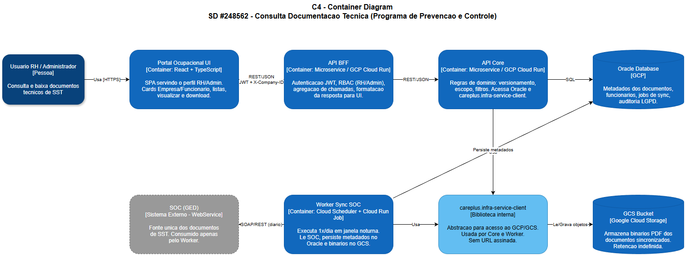
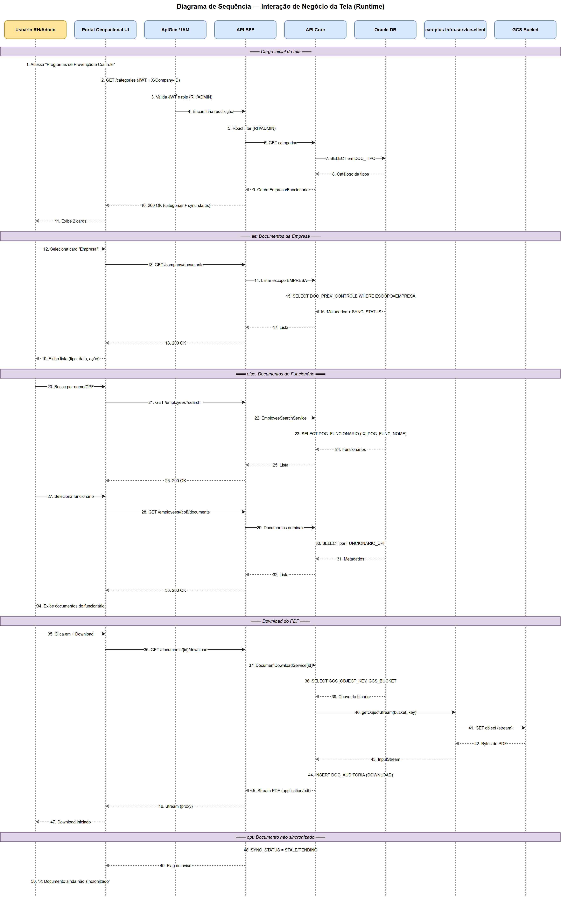
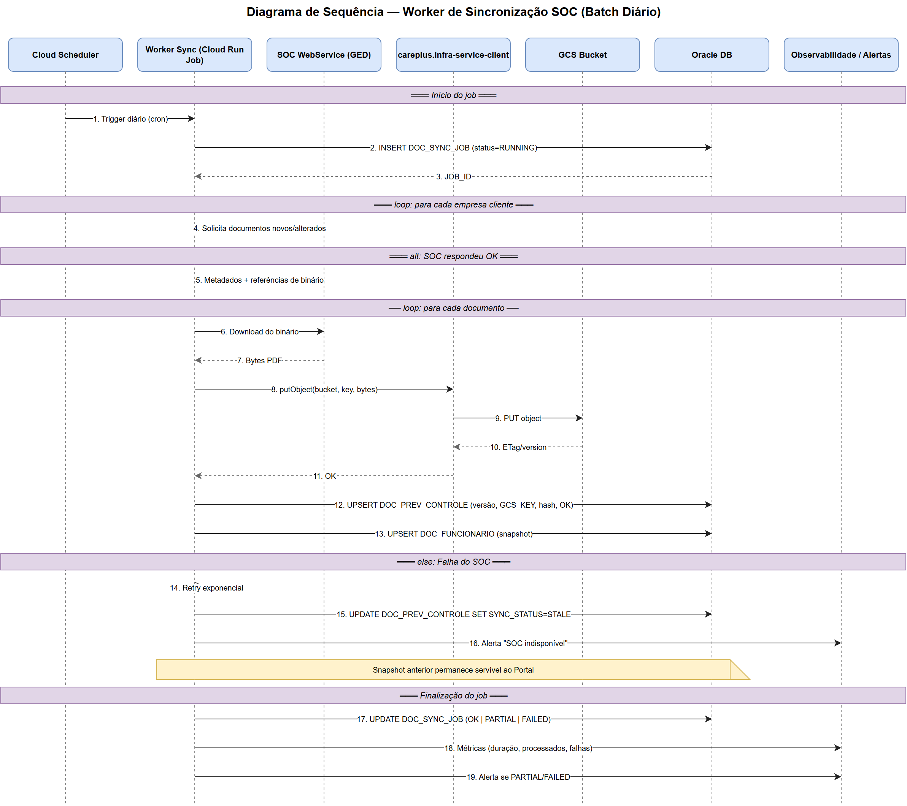
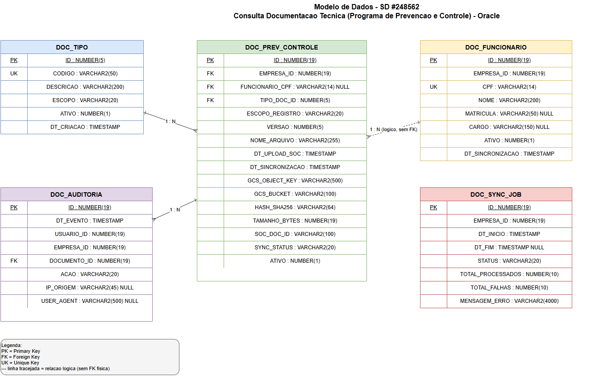
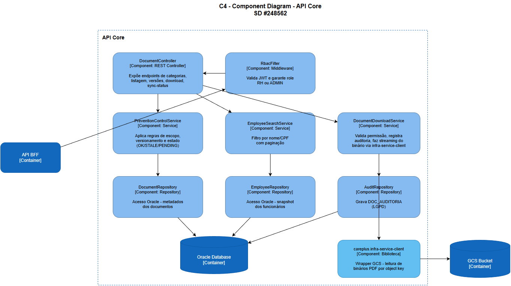

# SD #248562 — Consulta Documentação Técnica
## Programa de Prevenção e Controle | P.Ocup | Elaborar requerimentos de UX

**Autor:** Felipe Moraes Anéas
**Módulo:** Portal Ocupacional
**Data:** 2026-04-13


---

## 1. Introdução

Este documento descreve a arquitetura da solução para a funcionalidade de **Consulta de Documentação Técnica de Programas de Prevenção e Controle** no Portal Ocupacional. O objetivo é capturar e transmitir as decisões arquiteturais que suportam a exibição, o versionamento e o download de documentos de Saúde e Segurança do Trabalho (SST) sincronizados a partir do sistema **SOC (GED)**, garantindo segregação de acesso por perfil, alta disponibilidade e tolerância a falhas de integração.

A SD consome como input a Regra de Negócio elaborada pelo PO e define o desenho técnico-arquitetural (stack, contratos, domínios tocados, requisitos não-funcionais, diagramas C4 e integração).

---

## 2. Especificação de Arquitetura

### 2.1 Escopo
Disponibilizar ao perfil **RH/Administrador** do Portal Ocupacional uma tela de consulta de documentos técnicos de SST (PGR, LTCAT, AET, AEP, PPP, laudos NR-15/16, treinamentos NR-05/06/17, etc.) sincronizados diariamente do SOC, com navegação por dois escopos (**Documentos da Empresa** e **Documentos do Funcionário**), filtro por nome/CPF, histórico completo de versões e download em PDF.

### 2.2 Fora de escopo
- Upload/edição de documentos pelo Portal (o SOC é a fonte única de verdade)
- Consulta em tempo real ao SOC (toda leitura é do cache local sincronizado)
- Gestão de versões no Portal (apenas leitura do histórico espelhado)

---

## 3. Regra de Negócio (input do PO)

### 3.1 Contexto
Dado que uma empresa cliente está cadastrada no Portal Ocupacional
E que o serviço de integração com o SOC está configurado
E que o job diário de sincronização executa a integração dos documentos
E que o usuário autenticado possui perfil RH
E que o usuário seleciona a opção "Programas de Prevenção e Controle"

### 3.2 Cenários (BDD)

**Cenário 1: Visualizar lista de documentos de prevenção e controle**
- Dado que existem documentos PGR, LTCAT, AET ou AEP sincronizados no portal
- Quando o usuário acessa a tela de documentos
- Então o sistema deve exibir a lista de documentos disponíveis
- E cada item deve conter: Tipo de documento, Data de upload, Ação de download

**Cenário 2: Download de documento técnico**
- Dado que existe um documento técnico disponível
- Quando o usuário clica na ação de download
- Então o sistema deve realizar o download do arquivo em formato PDF

**Cenário 3: Acesso à funcionalidade sem permissão**
- Dado que o usuário autenticado não possui perfil RH/Admin
- Quando o usuário tenta acessar a funcionalidade
- Então a funcionalidade **não aparece no menu** (ocultação total)

**Cenário 4: Documento inexistente no SOC**
- Dado que não existem documentos do tipo selecionado no SOC
- Quando o usuário acessa a tela
- Então o sistema deve exibir *"Não há documentos disponíveis para este tipo no momento"*

**Cenário 5: Falha de job ou atraso de sincronização**
- Dado que o job de sync falhou ou está atrasado
- Quando o usuário acessa a tela
- Então o sistema deve exibir *"⚠ Documento ainda não sincronizado"*

### 3.3 Permissões e Perfis
- ✓ **RH / Administrador** — visualizar e baixar documentos
- ✗ **Demais perfis** — não enxergam a funcionalidade (controle em menu + rota + API)

### 3.4 Origem dos Dados e Integração
- **Fonte única:** SOC (GED)
- **Integração:** assíncrona, diária (batch, não tempo real)
- O Portal **não consulta** o SOC sob demanda
- Exibe apenas documentos **previamente sincronizados**
- Em falha: exibe **último documento válido disponível**

### 3.5 Versionamento e Histórico
- Histórico **completo e imutável**
- Ordenação do mais recente ao mais antigo
- Nenhum documento é sobrescrito ou perdido

### 3.6 UX — Comportamento da Tela
1. **Tela inicial:** dois cards — `Documentos da Empresa` e `Documentos do Funcionário`
2. **Documentos da Empresa:** lista direta com visualizar (👁) e download (⬇)
3. **Documentos do Funcionário:** filtro por nome/CPF → lista de funcionários → drill-down para documentos nominais

### 3.7 Matriz de Tipos de Documentos (17 tipos)

| # | Documento | Empresa | Funcionário | codigoGed (SOC) |
|---|---|:---:|:---:|:---:|
| 1 | AEP — Avaliação Ergonômica Preliminar | ✓ | | ⚠ pendente |
| 2 | AET — Análise Ergonômica | ✓ | | ⚠ pendente |
| 3 | Dosimetria de Ruído | ✓ | | ⚠ pendente |
| 4 | PPP — Perfil Profissiográfico Previdenciário | | ✓ | ⚠ pendente |
| 5 | Laudo de Insalubridade — NR 15 | ✓ | ✓ | ⚠ pendente |
| 6 | Laudo de Periculosidade — NR 16 | ✓ | ✓ | ⚠ pendente |
| 7 | LTCAT — Laudo Técnico Condições Ambiente Trabalho | ✓ | ✓ | ⚠ pendente |
| 8 | NR-01 Ordem de Serviço | | ✓ | ⚠ pendente |
| 9 | NR-05 Acompanhamento CIPA / Ata Reunião Mensal | ✓ | | ⚠ pendente |
| 10 | NR-05 Implantação CIPA / ATA Instalação e Posse | ✓ | | ⚠ pendente |
| 11 | NR-05 Mapa de Risco | ✓ | | ⚠ pendente |
| 12 | NR-05 Treinamento CIPA / Certificados | ✓ | ✓ | ⚠ pendente |
| 13 | NR-05 Designado CIPA / Carta Designação | ✓ | | ⚠ pendente |
| 14 | NR-05 Treinamento Designado CIPA | ✓ | ✓ | ⚠ pendente |
| 15 | NR-06 Treinamento EPI | ✓ | ✓ | ⚠ pendente |
| 16 | Treinamento Anexo II NR-17 / Certificados | ✓ | ✓ | ⚠ pendente |
| 17 | Treinamento Ergonomia em Home Office | ✓ | | ⚠ pendente |

**Três categorias de escopo:**
- **Só Empresa (8):** AEP, AET, Dosimetria, NR-05 Ata/Impl/Mapa/Designado-Carta, Ergo Home Office
- **Só Funcionário (2):** PPP, NR-01 OS
- **Ambos (7):** NR-15, NR-16, LTCAT, NR-05 Treinamento CIPA, NR-05 Treinamento Designado, NR-06 EPI, NR-17

Tipos "Ambos" recebem do SOC **dois registros distintos** com flag de escopo: o laudo corporativo (aba Empresa) e a evidência individual (aba Funcionário).

---

## 4. Definições e Padrões

| Sigla | Descrição |
|---|---|
| **SOC** | Sistema externo de Saúde Ocupacional — fonte dos documentos |
| **GED** | Gestão Eletrônica de Documentos |
| **BFF** | Backend For Frontend — microserviço de orquestração |
| **Core** | Microserviço de domínio — regras de negócio e persistência |
| **Worker** | Serviço em background responsável pela sincronização diária SOC → Oracle |
| **GCS** | Google Cloud Storage |
| **GCP** | Google Cloud Platform |
| **RH** | Recursos Humanos (perfil autorizado) |
| **SST** | Saúde e Segurança do Trabalho |
| **NR** | Norma Regulamentadora (MTE) |
| **PGR/LTCAT/AET/AEP/PPP** | Tipos de documentos técnicos ocupacionais |

---

## 5. Visão de Arquitetura



**Fluxo de leitura (runtime):** Portal → BFF → Core → Oracle. Sem toque no SOC.
**Fluxo de download:** Portal → BFF → Core → `careplus.infra-service-client` → GCS (stream do binário, **sem URL assinada**).
**Fluxo de sincronização (batch diário):** Worker → SOC (SOAP `DownloadArquivosGed`) → converte Base64 → `byte[]` → `careplus.infra-service-client` → GCS + Oracle.

Fontes editáveis draw.io:
- `c4-container.drawio` — C4 nível 2 (Container)
- `c4-component.drawio` — C4 nível 3 (Component — API Core)

### 5.1 Diagrama de Sequência — Interação de Negócio da Tela (Runtime)

Fluxo do usuário RH/Admin acessando a tela de Documentação Técnica, navegando por escopo, filtrando funcionário e baixando um PDF.



### 5.2 Diagrama de Sequência — Worker de Sincronização SOC (Batch Diário)

Fluxo do job noturno que sincroniza documentos do SOC para o Oracle/GCS, com tolerância a falhas.



---

## 6. Tecnologias Utilizadas

| Funcionalidade | Tecnologia |
|---|---|
| Frontend | Angular + TypeScript (Portal Ocupacional) |
| ApiGee | Gateway |
| API BFF | Microserviço REST |
| API Core | Microserviço REST |
| Worker | Serviço background (Cloud Scheduler + Cloud Run Job) |
| Banco de Dados | **Oracle** (GCP) |
| Storage de binários | **GCS** (Google Cloud Storage) |
| Acesso ao GCP | **careplus.infra-service-client** (biblioteca interna) |
| Integração externa | SOC WebService (SOAP — operação `DownloadArquivosGed`, resposta MTOM/XOP com binário em Base64) |
| Cloud | **Google Cloud Platform (GCP)** |
| Autenticação | Bearer Token (JWT) + `X-Company-ID` (multi-tenant) |
| Observabilidade | Logs estruturados + métricas GCP + alertas |
| Diagramas | **draw.io** (`.drawio` XML) |

---

## 7. Sistemas Externos

| Sistema | Descrição |
|---|---|
| **SOC (GED)** | WebService externo, fonte única dos documentos de SST. Consumido exclusivamente pelo Worker em rotina diária assíncrona. Nunca consultado em runtime pelo Portal. |

---

## 8. Sistemas Internos

| Sistema | Descrição |
|---|---|
| **Portal Ocupacional UI** | Frontend React consumido por perfis RH/Admin |
| **API BFF** | Orquestra chamadas do Portal, aplica RBAC, agrega respostas do Core |
| **API Core** | Domínio de documentos ocupacionais — persistência e regras de versionamento |
| **Worker Sync SOC** | Executa job diário de sincronização SOC → Oracle/GCS |
| **Oracle DB (GCP)** | Persistência de metadados, funcionários e auditoria |
| **GCS Bucket** | Armazena binários PDF |
| **careplus.infra-service-client** | Biblioteca interna para I/O com GCP/GCS, usada por Core e Worker |

---

## 9. Domínios de Negócio

| Domínio | Descrição |
|---|---|
| **Empresa** | Documentos coletivos (PGR, LTCAT corporativo, AEP, AET, Dosimetria, Mapa de Risco, Atas CIPA) |
| **Funcionário** | Documentos nominais vinculados a CPF (PPP, Ordem de Serviço NR-01, evidências individuais de treinamento) |
| **Documento Técnico** | Metadados: tipo, escopo, data upload, versão, chave GCS, hash |
| **Permissionamento** | RBAC — apenas RH/Admin visualizam a funcionalidade |
| **Sincronização** | Estado do último job de sync, flag de documentos não sincronizados |
| **Auditoria LGPD** | Log de visualizações e downloads (usuário, empresa, documento, timestamp) |

---

## 10. Integração com Alta Disponibilidade

A aplicação integra-se com o SOC, sistema externo não controlado pela Empresa.

| Critério | Medida de resolução |
|---|---|
| Falha do SOC durante o job | Worker mantém os últimos documentos válidos já sincronizados. Portal serve o snapshot anterior. |
| Latência alta no SOC | Job noturno, fora do horário de consulta |
| Indisponibilidade prolongada | Portal exibe *"⚠ Documento ainda não sincronizado"* para tipos com atraso |
| Tipo inexistente | Portal exibe *"Não há documentos disponíveis para este tipo no momento"* |
| Sem acesso runtime ao SOC | Download lê binário já persistido no GCS via `careplus.infra-service-client`, nunca faz proxy ao SOC |
| Falha do GCS | Retry + circuit breaker no `careplus.infra-service-client`; alerta para operação |
| Falha parcial do job | Status `PARTIAL` registrado em `DOC_SYNC_JOB`; alerta automático |

---

## 11. Requisitos Arquiteturais

| Componente | Descrição |
|---|---|
| **API BFF** | Recebe requisições do Portal, valida JWT + X-Company-ID, aplica filtro de RBAC (RH/Admin), chama o Core e formata resposta para a UI |
| **API Core** | Expõe endpoints de listagem por escopo, busca por filtro (nome/CPF), versionamento, metadados e stream de download (via `careplus.infra-service-client`) |
| **Worker Sync** | Job diário agendado (Cloud Scheduler + Cloud Run Job). Consome SOC Web Service (SOAP `DownloadArquivosGed`), converte o binário recebido em Base64 para `byte[]`, persiste metadados no Oracle e envia o binário ao GCS via `careplus.infra-service-client`. Mantém `DOC_SYNC_JOB` |
| **Oracle DB** | Armazena metadados, funcionários, jobs de sync e auditoria LGPD |
| **GCS Bucket** | Armazena binários PDF com retenção indefinida. Acesso **somente** via `careplus.infra-service-client` |
| **careplus.infra-service-client** | Biblioteca interna — única via de I/O com GCP/GCS. Não há URL assinada; downloads são stream servidos pelo Core |
| **API Gateway / IAM** | Controle de acesso por role antes de chegar no BFF |

---

## 12. Requisitos Não-Funcionais

| Categoria | Requisito |
|---|---|
| **Segurança** | RBAC obrigatório; funcionalidade **oculta** do menu para perfis não autorizados; autenticação JWT; X-Company-ID multi-tenant; acesso ao GCS restrito à identity do Core/Worker via `careplus.infra-service-client` |
| **Performance** | Listagem < 2s para até 500 documentos; início do download em < 3s |
| **Disponibilidade** | Portal 99,5% — independente da disponibilidade do SOC (degradação graciosa) |
| **Escalabilidade** | BFF e Core stateless, horizontalmente escaláveis no GCP (Cloud Run / GKE) |
| **Retenção** | Histórico imutável — nenhum documento é sobrescrito ou perdido |
| **Auditoria** | Toda ação (visualizar/download) logada em `DOC_AUDITORIA` |
| **LGPD** | CPF tratado como dado sensível; logs mascarados; acesso restrito |
| **Observabilidade** | Métricas do job de sync (duração, processados, falhas); alertas em falha do Worker |
| **Resiliência** | Retry exponencial ao SOC; circuit breaker no `careplus.infra-service-client` |
| **Usabilidade** | Mensagens claras para estados vazios e falha de sync |

---

## 13. Arquitetura Lógica

**Camadas:**
1. **Apresentação** — React UI (cards → listas → visualizar/download)
2. **BFF** — Autenticação, RBAC, agregação, formatação
3. **Core (Domínio)** — Versionamento, escopo, filtros, validações, orquestração do download
4. **Persistência** — Oracle (metadados) + GCS via `careplus.infra-service-client` (binários)
5. **Integração** — Worker (único ponto de contato com SOC)

---

## 14. Contratos de API (BFF)

Contratos OpenAPI completos em [`openapi.yaml`](./openapi.yaml).

| Método | Endpoint | Descrição |
|---|---|---|
| `GET` | `/api/v1/prevention-control/categories` | Retorna cards Empresa e Funcionário |
| `GET` | `/api/v1/prevention-control/company/documents` | Lista documentos do escopo Empresa |
| `GET` | `/api/v1/prevention-control/employees?search=` | Lista funcionários com filtro nome/CPF |
| `GET` | `/api/v1/prevention-control/employees/{cpf}/documents` | Documentos nominais do funcionário |
| `GET` | `/api/v1/prevention-control/documents/{id}/versions` | Histórico de versões (mais recente → mais antigo) |
| `GET` | `/api/v1/prevention-control/documents/{id}/download` | Stream PDF (via `careplus.infra-service-client`) |
| `GET` | `/api/v1/prevention-control/sync-status` | Status da última sincronização |

Todos os endpoints exigem `Authorization: Bearer <JWT>` + `X-Company-ID` e validam role `RH` ou `ADMIN`.

---

## 14.1 Contrato de Integração Worker → SOC (SOAP)

O Worker consome o SOC via **SOAP** com MTOM/XOP para transferência do binário do documento.

- **Namespace:** `http://services.soc.age.com/`
- **Operação (request):** `downloadArquivosPorGed`
- **Operação (response):** `DownloadArquivosGed`
- **Protocolo de transferência:** MTOM/XOP (`xop:Include`) — o binário é referenciado por href no envelope SOAP

### Request (Worker → SOC)

```xml
<soapenv:Envelope xmlns:soapenv="http://schemas.xmlsoap.org/soap/envelope/"
                  xmlns:ser="http://services.soc.age.com/">
  <soapenv:Header/>
  <soapenv:Body>
    <ser:downloadArquivosPorGed>
      <downloadPorGed>
        <identificacaoWsVo>
          <codigoEmpresaPrincipal></codigoEmpresaPrincipal>
          <codigoResponsavel></codigoResponsavel>
          <codigoUsuario></codigoUsuario>
        </identificacaoWsVo>
        <codigoEmpresa></codigoEmpresa>
        <codigoGed></codigoGed>
      </downloadPorGed>
    </ser:downloadArquivosPorGed>
  </soapenv:Body>
</soapenv:Envelope>
```

### Campos do Request

| Campo | Tipo | Descrição |
|---|---|---|
| `codigoEmpresaPrincipal` | String | Código da empresa principal cadastrada no SOC |
| `codigoResponsavel` | String | Código do responsável técnico pela integração |
| `codigoUsuario` | String | Código do usuário de integração (credencial do Worker) |
| `codigoEmpresa` | String | Código da empresa cliente (tenant) |
| `codigoGed` | String | **⚠ PENDENTE** — Código do documento no GED/SOC. Deve ser mapeado para cada um dos 17 tipos de documento (ver seção 3.7). Sem este mapeamento o Worker não consegue requisitar os documentos corretos ao SOC. |

> **Pendência crítica:** o mapeamento entre os 17 tipos de documento (`DOC_TIPO`) e seus respectivos `codigoGed` no SOC ainda não foi fornecido. Este mapeamento deve ser incluído na tabela `DOC_TIPO` (coluna `CODIGO_GED`) e informado pelo time de integração/SOC antes da implementação do Worker.

### Response (SOC → Worker)

```xml
<soap:Envelope xmlns:soap="http://schemas.xmlsoap.org/soap/envelope/">
  <SOAP-ENV:Header xmlns:SOAP-ENV="http://schemas.xmlsoap.org/soap/envelope/"/>
  <soap:Body>
    <ns2:nomeDoServico xmlns:ns2="http://services.soc.age.com/">
      <DownloadArquivosGed>
        <informacaoGeral>
          <codigoMensagem>SOC-100</codigoMensagem>
          <mensagem>SUCESSO. Operação realizada com sucesso</mensagem>
          <numeroErros>0</numeroErros>
        </informacaoGeral>
        <bytesArquivo>
          <xop:Include href="link" xmlns:xop="http://www.w3.org/2004/08/xop/include"/>
        </bytesArquivo>
      </DownloadArquivosGed>
    </ns2:nomeDoServico>
  </soap:Body>
</soap:Envelope>
```

### Campos do Response

| Campo | Tipo | Descrição |
|---|---|---|
| `codigoMensagem` | String | Código de retorno do SOC. `SOC-100` = sucesso |
| `mensagem` | String | Descrição textual do resultado da operação |
| `numeroErros` | Integer | `0` = sem erros; valor positivo indica falha parcial |
| `bytesArquivo / xop:Include` | MTOM/XOP | Referência ao binário do arquivo — entregue como Base64 |

### Tratamento do binário no Worker

O binário recebido via `xop:Include` chega codificado em **Base64**. O Worker realiza a conversão:

```
Base64 (SOC response) → byte[] → careplus.infra-service-client → GCS Bucket
```

O `byte[]` resultante é enviado diretamente ao GCS via `careplus.infra-service-client`, sem persistir o binário em disco ou memória intermediária além do necessário para o upload.

### Códigos de retorno SOC conhecidos

| Código | Significado | Ação do Worker |
|---|---|---|
| `SOC-100` | Sucesso | Persiste binário no GCS e metadados no Oracle; `SYNC_STATUS = OK` |
| Outros / `numeroErros > 0` | Falha ou erro parcial | Mantém último documento válido; `SYNC_STATUS = STALE`; registra em `DOC_SYNC_JOB` |

---

## 15. Modelo de Dados (Oracle)



Fonte editável: [`er-diagram.drawio`](./er-diagram.drawio)
DDL completo em [`schema.sql`](./schema.sql).

**Tabelas:**
- `DOC_TIPO` — catálogo dos 17 tipos com escopo (EMPRESA / FUNCIONARIO / AMBOS)
- `DOC_PREV_CONTROLE` — metadados dos documentos sincronizados; referência ao binário no GCS via `GCS_OBJECT_KEY`
- `DOC_FUNCIONARIO` — snapshot dos funcionários para filtro por nome/CPF
- `DOC_SYNC_JOB` — controle de execução do Worker (status, totais, erros)
- `DOC_AUDITORIA` — log LGPD de acessos (VISUALIZAR / DOWNLOAD)

**Decisões:**
- Chave única por versão: `(EMPRESA_ID, TIPO_DOC_ID, FUNCIONARIO_CPF, VERSAO, ESCOPO_REGISTRO)`
- `FUNCIONARIO_CPF` nullable — nulo para documentos de escopo Empresa
- `SYNC_STATUS` com três estados: `OK | STALE | PENDING` → dirige as mensagens de UI
- Binários **não** ficam no Oracle; somente `GCS_OBJECT_KEY` + `GCS_BUCKET`

---

## 16. Diagramas (draw.io)

Todos os diagramas desta SD são gerados em **draw.io** (formato `.drawio` XML mxGraph) e exportados como PNG para visualização inline.

### 16.1 C4 — Container Diagram


### 16.2 C4 — Component Diagram (API Core)


| Arquivo fonte | Nível C4 | Descrição |
|---|---|---|
| [`c4-container.drawio`](./c4-container.drawio) | Container | Visão geral — UI, BFF, Core, Worker, Oracle, GCS, SOC, careplus.infra-service-client |
| [`c4-component.drawio`](./c4-component.drawio) | Component | Decomposição interna do API Core (Controller, RbacFilter, Services, Repositories, infra-client) |

---

## 17. Traçabilidade — Regra de Negócio × Componentes

| Cenário da RN | Componente responsável | Artefato |
|---|---|---|
| Visualizar lista de documentos | BFF → Core → `DocumentRepository` → Oracle | openapi.yaml / schema.sql |
| Download PDF | BFF → Core → `DocumentDownloadService` → `careplus.infra-service-client` → GCS | c4-component.drawio |
| Acesso sem permissão | `RbacFilter` no BFF e Core bloqueia antes do Controller | c4-component.drawio |
| Documento inexistente | Core retorna lista vazia → UI exibe mensagem padrão | openapi.yaml (`MensagemEstado`) |
| Sincronização do binário SOC | Worker envia `codigoGed` + `codigoEmpresa` via SOAP `downloadArquivosPorGed` → recebe Base64 → converte para `byte[]` → envia ao GCS via `careplus.infra-service-client` | seção 14.1 |
| **⚠ Mapeamento codigoGed** | **PENDENTE** — mapear `codigoGed` do SOC para cada um dos 17 tipos em `DOC_TIPO.CODIGO_GED` | seção 3.7 + seção 14.1 |
| Falha/atraso do job | Worker atualiza `SYNC_STATUS` em `DOC_PREV_CONTROLE` → BFF retorna flag → UI exibe *"⚠ Documento ainda não sincronizado"* | schema.sql + openapi.yaml |
| Histórico de versões | `DocumentRepository` ordena por `DT_UPLOAD_SOC DESC` | schema.sql (`IX_DOC_PREV_DT_UPLOAD`) |
| Filtro por nome/CPF | `EmployeeSearchService` → `EmployeeRepository` com índice `IX_DOC_FUNC_NOME` | schema.sql |
| Auditoria LGPD | `AuditRepository` grava `DOC_AUDITORIA` em toda visualização/download | schema.sql |

